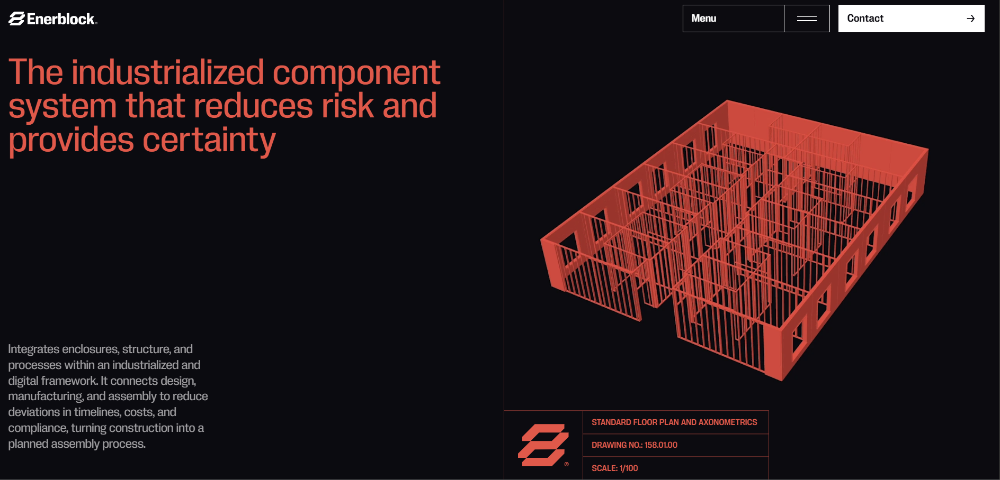

use the LLM Wiki and the vault for more context in C:\Home\OneDrive\rosa\HOME\Rosa KB\rosa Padel you also have permission to read and access all of C:\Home\OneDrive\rosa\

, make a new proposal for the website, it needs an update for customers, players and clubs (or court manufacturers) and for investors to udnerstand the full scope. I feel like www.rosapadel.com has a small scope to what rosa actually aims to be, I want a specific sector for rosa core (HD and LED), rosa vision and rosa coach (vision coach).

Keep the 3d model animation. Keep using rosa colors (mexican pink, offwhite, black)

I want the feel to look clean, preferrably no gradients. like https://dingdongpingpong.club/  or https://www.awwwards.com/sites/enerblock - https://enerblock.net/en/ this is a great example since it even incorporates a 3d model 

I think each product should have their own page, and describe.

I like this calculator in www.clutchapp.io:

<svg xmlns="http://www.w3.org/2000/svg" width="24" height="24" viewBox="0 0 24 24" fill="none" stroke="currentColor" stroke-width="2" stroke-linecap="round" stroke-linejoin="round" class="lucide lucide-calculator w-6 h-6 text-primary"><rect width="16" height="20" x="4" y="2" rx="2"></rect><line x1="8" x2="16" y1="6" y2="6"></line><line x1="16" x2="16" y1="14" y2="18"></line><path d="M16 10h.01"></path><path d="M12 10h.01"></path><path d="M8 10h.01"></path><path d="M12 14h.01"></path><path d="M8 14h.01"></path><path d="M12 18h.01"></path><path d="M8 18h.01"></path></svg>

<h3 class="text-2xl font-semibold text-cream">Impacto Estimado</h3>
Ve tus retornos potenciales

<label for="calc-courts" class="block text-cream text-sm font-medium mb-2">Número de pistas</label><input id="calc-courts" type="number" class="w-full px-4 py-3 bg-charcoal-light border border-border rounded-lg text-cream focus:outline-none focus:ring-2 focus:ring-primary/50" value="4">

<label for="calc-bookings" class="block text-cream text-sm font-medium mb-2">Reservas promedio por pista / mes</label><input id="calc-bookings" type="number" class="w-full px-4 py-3 bg-charcoal-light border border-border rounded-lg text-cream focus:outline-none focus:ring-2 focus:ring-primary/50" value="200">

<label for="calc-price" class="block text-cream text-sm font-medium mb-2">Precio promedio de reserva (€)</label><input id="calc-price" type="number" class="w-full px-4 py-3 bg-charcoal-light border border-border rounded-lg text-cream focus:outline-none focus:ring-2 focus:ring-primary/50" value="50">

Incremento estimado de ingresos mensuales
<button class="text-cream-muted hover:text-cream transition-colors" aria-label="Cómo se calcula esta estimación" type="button" aria-haspopup="dialog" aria-expanded="false" aria-controls="radix-:r9:" data-state="closed"><svg xmlns="http://www.w3.org/2000/svg" width="14" height="14" viewBox="0 0 24 24" fill="none" stroke="currentColor" stroke-width="2" stroke-linecap="round" stroke-linejoin="round" class="lucide lucide-info"><circle cx="12" cy="12" r="10"></circle><path d="M12 16v-4"></path><path d="M12 8h.01"></path></svg></button>

€800 – €2,000

≈ €9,600 – €24,000 por año

La estimación refleja solo el incremento en reservas y no incluye el potencial de patrocinios, compartición de contenido u otras fuentes de ingresos complementarias. Los resultados reales varían según el club.

<a href="#contact" class="btn-primary inline-flex items-center gap-2">Obtener Clutch ahora<svg xmlns="http://www.w3.org/2000/svg" width="18" height="18" viewBox="0 0 24 24" fill="none" stroke="currentColor" stroke-width="2" stroke-linecap="round" stroke-linejoin="round" class="lucide lucide-arrow-right"><path d="M5 12h14"></path><path d="m12 5 7 7-7 7"></path></svg></a>

I want a human design, I love the feel UI and UX of of https://dingdongpingpong.club/ and would want to have something similar, they do similar things but for pingpong, I do like their sliding cards and uniqueness and creativity.

tell me if you might need any additional content that we dont have right now

make sure the website beats competiros when being compared in look, and feel:
Padel scoreboards:
https://scorebot.app/
https://scorepadel.es/

Video Stats:
https://www.clutchapp.io/
https://www.wingfield.io/en/products/analytics
https://www.padelize.ai/

Video Highlights:
https://pushitreplays.com/

AI Coach:
https://www.offcourtz.com/
